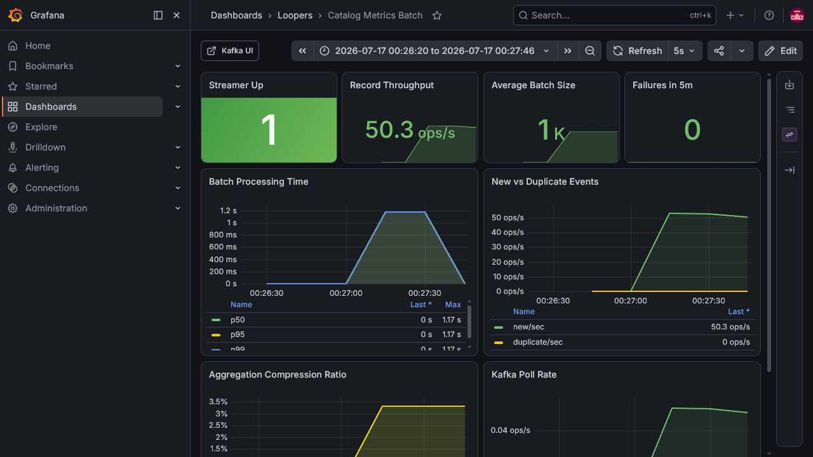
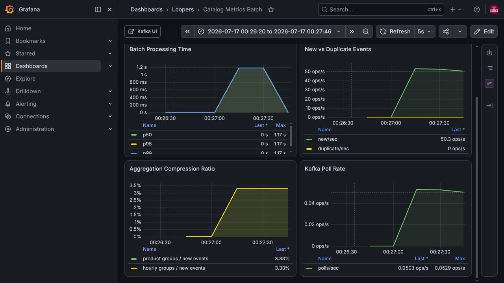

# Catalog Metrics Batch 3,000건 실측 기록

## 1. 결론

- `commerce-streamer` 전체 테스트 59개와 Metrics 관련 테스트 40개가 모두 통과했다.
- 신규 `PRODUCT_VIEWED` 이벤트 3,000건을 3개 Kafka 파티션에서 모두 소비했으며 최종 Consumer Lag은 0이었다.
- `event_handled`, 일간 Metric, 시간별 Metric의 조회 수 합계가 모두 3,000으로 일치했다.
- 3,000건은 파티션별 810건, 1,140건, 1,050건의 세 Batch로 처리되었다.
- 상품 및 시간별 Metric은 각각 100개 그룹으로 합쳐졌다. 이벤트 대비 UPSERT 그룹 비율은 `100 / 3,000 = 3.33%`다.
- 가장 오래 걸린 Batch의 애플리케이션 내부 처리 시간은 약 1.20초였다.
- Grafana의 `50.3 ops/s`는 1분 `rate()` 구간으로 평활화된 값이다. 이 수치를 시스템의 최대 처리량으로 해석하면 안 된다.

## 2. 측정 정보

| 항목 | 값 |
|---|---|
| 측정 일시 | 2026-07-17 |
| 브랜치 | `volume-9` |
| 기준 커밋 | `1baaf1f2` |
| 실행 환경 | Windows 로컬 Docker |
| Kafka | 단일 Broker, 전용 Topic 3 Partitions |
| MySQL | 전용 `loopers_metrics_monitor` DB |
| Consumer Group | `catalog-metrics-monitor` |
| Ranking Consumer | 비활성화 |
| 이벤트 | `PRODUCT_VIEWED` 3,000건, 100개 상품, 고유 UUID |

공용 Batch Listener 설정은 다음과 같다.

| 설정 | 값 |
|---|---:|
| Listener concurrency | 3 |
| `max.poll.records` | 3,000 |
| `fetch.min.bytes` | 1 MiB |
| `fetch.max.wait.ms` | 5,000 ms |

## 3. 자동화 테스트

Metrics 범위 테스트를 먼저 실행하고, 이어서 Streamer 모듈 전체 테스트를 실행했다.

```powershell
.\gradlew :apps:commerce-streamer:test --tests "com.loopers.metrics.*"
.\gradlew :apps:commerce-streamer:test
```

| 범위 | 테스트 | 실패 | 오류 | Skipped | 결과 |
|---|---:|---:|---:|---:|---|
| Metrics 관련 | 40 | 0 | 0 | 0 | 통과 |
| Commerce Streamer 전체 | 59 | 0 | 0 | 0 | 통과 |

전체 테스트의 명령 실행 시간은 약 92.8초였다. 테스트 케이스가 보고한 실행 시간의 합은 39.559초이며, 컨텍스트와 Testcontainers 준비 시간은 이 값에 포함되지 않는다.

## 4. 부하 테스트 절차

Streamer를 전용 DB와 Topic, Consumer Group으로 실행한 뒤 다음 명령으로 이벤트를 발행했다.

```powershell
powershell -NoProfile -ExecutionPolicy Bypass -File .\scripts\catalog-metrics-load.ps1 -Count 3000 -ProductCount 100
```

Producer는 3,000건을 2,124ms에 발행했다. 이 시간은 Producer 발행 시간이며 Consumer의 최종 DB 반영 완료 시간은 아니다.

## 5. Kafka 처리 결과

| Partition | 실행 전 Offset | 실행 후 Offset | 처리 건수 |
|---:|---:|---:|---:|
| 0 | 813 | 1,623 | 810 |
| 1 | 1,155 | 2,295 | 1,140 |
| 2 | 1,062 | 2,112 | 1,050 |
| 합계 | 3,030 | 6,030 | 3,000 |

최종 Consumer Group의 세 파티션 모두 `CURRENT-OFFSET == LOG-END-OFFSET`이었고 Lag은 0이었다.

## 6. 애플리케이션 메트릭

| 메트릭 | Count | Sum | Max | 해석 |
|---|---:|---:|---:|---|
| Batch records | 3 | 3,000 | 1,140 | 파티션별 Poll 3회 |
| New events | 3 | 3,000 | 1,140 | 모두 신규 처리 |
| Duplicate events | 3 | 0 | 0 | 중복 없음 |
| Product groups | 3 | 100 | 38 | 상품 기준 선집계 |
| Hourly groups | 3 | 100 | 38 | 상품과 시간 기준 선집계 |
| Processing time | 3 | 3.3235초 | 1.1993초 | 세 Batch 처리 시간 |
| Failures | - | 0 | - | 처리 실패 없음 |

세 Batch는 concurrency 3으로 병렬 처리되므로 Processing time의 합 3.3235초를 전체 Wall-clock 시간으로 보면 안 된다. 가장 느린 Batch의 1.1993초가 병렬 처리 구간을 판단하는 데 더 가까운 값이지만, Kafka 전달부터 DB 반영 완료까지의 정확한 End-to-End Latency는 별도 타임스탬프 계측이 필요하다.

상품 및 시간별 그룹 압축률은 모두 3.33%다. 즉, 3,000개의 이벤트를 각 집계 테이블에 100개 Delta로 반영했다. 반면 멱등 처리를 위한 `event_handled`에는 원본 이벤트 수와 같은 3,000행이 저장된다.

## 7. DB 정합성

| 검증 대상 | Row 수 | 조회 수 합계 |
|---|---:|---:|
| `event_handled` | 3,000 | - |
| `product_metrics` | 100 | 3,000 |
| `product_metric_hourly` | 100 | 3,000 |

Kafka Offset 증가량, 신규 이벤트 메트릭, `event_handled` 행 수, 두 Metric 테이블의 조회 수 합계가 모두 3,000으로 일치했다.

## 8. Grafana 캡처

측정 구간은 `2026-07-17 00:26:20 ~ 00:27:46`으로 고정했다. 첫 번째 캡처에서 `Streamer Up=1`, 실패 0, 평균 Batch 1,000건과 1분 Rate를 확인할 수 있다.



두 번째 캡처는 Batch 처리 시간, 신규/중복 이벤트, 3.33% 집계 비율과 Kafka Poll Rate를 보여준다.



## 9. 해석 시 주의점

- `Record Throughput`은 `rate(catalog_metrics_batch_records_sum[1m])`이다. 한 번에 3,000건을 처리해도 1분 구간에서는 약 50 ops/s로 표시된다.
- `Kafka Poll Rate`도 같은 1분 구간을 사용한다. Poll 3회는 약 0.05 ops/s로 표시된다.
- Batch 표본이 3개뿐이므로 p50, p95와 p99를 성능 결론에 사용하기에는 표본 수가 부족하다.
- 로컬 Docker, 단일 Kafka Broker와 단일 MySQL에서 한 번 실행한 결과다. 운영 환경의 처리 용량을 의미하지 않는다.
- 이번 측정은 모두 신규 이벤트다. 중복 이벤트, DB 지연, Kafka 재처리와 부분 실패 시나리오는 별도로 측정해야 한다.
- Producer 발행 시간과 Consumer 내부 Batch 처리 시간은 확인했지만, 이벤트별 End-to-End Latency는 아직 계측하지 않았다.

## 10. 다음 측정 제안

1. 100, 500, 1,000, 3,000건을 각 10회 이상 반복해 평균과 분산을 비교한다.
2. 같은 `eventId`를 재발행해 중복 제거 경로의 처리 시간과 DB 부하를 측정한다.
3. MySQL 지연을 주입해 Batch 처리 시간, Lag 증가와 회복 시간을 함께 관찰한다.
4. 이벤트의 발생 시각과 DB 반영 완료 시각을 계측해 End-to-End Latency를 추가한다.
5. `event_handled` 3,000행 보존 비용과 Metric UPSERT 100그룹의 비용을 분리해 측정한다.
